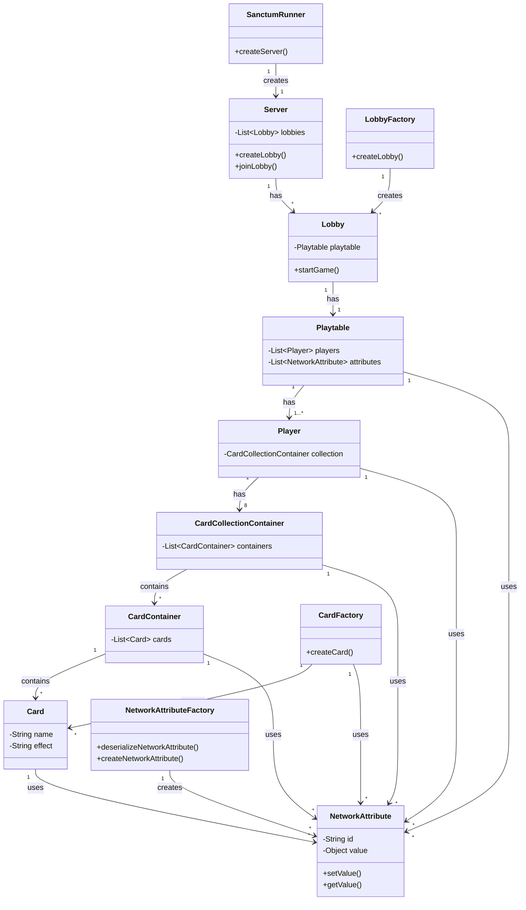

# Sanctum-Core

Sanctum-Core is a Trading Card Game (TCG) playtable simulator designed to provide a flexible platform for custom TCG implementations.

## Table of Contents
- [Overview](#overview)
- [Project Structure](#project-structure)
- [Key Features](#key-features)
- [Getting Started](#getting-started)
- [Architecture](#architecture)
- [Network Communication](#network-communication)
- [Contributing](#contributing)

## Overview

Sanctum-Core is a comprehensive TCG playtable simulator that enables players to engage in card games across different platforms. It's designed with flexibility in mind, allowing for easy integration with custom frontends through its Network Attribute system.

## Project Structure

The repository is structured across four key projects:

1. **Sanctum Core**: The heart of the project, managing core gameplay functionality.
2. **Sanctum Server**: Oversees multiple Sanctum Core instances and includes a lobby system.
3. **Sanctum Runner**: Executes the server with configurable settings.
4. **Sanctum Testing**: Contains unit and integration tests for both Core and Server components.

## Key Features

- Flexible TCG playtable simulator
- Lobby system for player connections
- Network Attribute system for seamless communication
- Multi-threaded lobby management
- Comprehensive testing suite

## Getting Started

### Setting up Server
Clone Repository:
`git clone https://github.com/Foulgaze/Sanctum-Core`
Change directory into runner:
`cd Sanctum-Core/Sanctum-Core-Runner`
Build project:
`dotnet build`
Run project;
`dotnet run`

### Setting up Client Playtable
Clone Repository:
`git clone https://github.com/Foulgaze/Sanctum-Core`
CD into Sanctum-Core directory:
`cd Sanctum-Core/Sanctum-Core`
Build project:
`dotnet build`
Take DLL and reference in frontend Playtable Project
```csharp
Playtable table = new Playtable("pathToCards", "pathToTokens", isSlave : true);
table.networkAttributeFactory.attributeValueChanged += NetworkAttributeChange();
```
Some outside code is needed to connect to Server, that can be seen in [Network Communication](#network-communication)

## Architecture

### Sanctum Core

#### Playtable Design

The Playtable is the central component of the Sanctum Core game system, managing the game state and player interactions. Here's an overview of its design:

1. **Playtable**: 
   - Represents the game board or play area
   - Manages a list of Players
   - Holds a collection of NetworkAttributes for synchronized game state

2. **Player**:
   - Represents an individual player in the game
   - Contains a CardCollectionContainer for managing the player's cards

3. **CardCollectionContainer**:
   - Holds multiple CardContainers
   - Represents different card zones (e.g., hand, deck, discard pile)

4. **CardContainer**:
   - Contains a list of Cards
   - Represents a specific collection of cards (e.g., a player's hand)

5. **Card**:
   - Represents an individual game card
   - Has properties like name, effect, cost
   - Created by the CardFactory

6. **CardFactory**:
   - Responsible for creating Card objects
   - Uses NetworkAttributes to synchronize card data

7. **NetworkAttribute**:
   - Used throughout the system for state synchronization
   - Playtable, Player, CardCollectionContainer, CardContainer, and Card all use NetworkAttributes

The Playtable is created within a Lobby when a game starts. It initializes the game state, including setting up players and their initial card collections. During gameplay, the Playtable manages turns, facilitates card interactions, and updates the game state using the NetworkAttribute system.

This design allows for a flexible and scalable card game system, where game rules and card effects can be easily implemented and modified. The use of NetworkAttributes throughout the system ensures that all game state changes are properly synchronized between the server and connected clients.
### Networking
Sanctum Core uses a Network Attribute system to manage game state and communication. Key components include:

- **NetworkAttribute**: Base class for networked attributes
- **NetworkAttribute<T>**: Strongly-typed network attributes
- **NetworkAttributeFactory**: Manages creation and updates of network attributes

#### Sanctum Server

The server listens for TCP connections and supports various commands for lobby management and game initialization. The server can support any number of lobbies with a separate playtable for each. 


Below is a outline of how the entire architecture, with some relevant public functions notated:


## Network Communication
The Sanctum Core server uses a simple TCP-based protocol for communication. Here's a brief guide on how to interact with the server:   
### Message Format   
Each message sent to the server should follow this format: 
1. A 4-digit message size (padded with leading zeros if necessary) 
2. A JSON-serialized `NetworkCommand` object   

### Message Size
```csharp
public static string AddMessageSize(string message)
{
    string msgByteSize = message.Length.ToString().PadLeft(4, '0');
    return msgByteSize + message;
}
```
### NetworkCommand Structure   
```csharp 
public class NetworkCommand
{
	public int opCode; public string instruction; 
}
```

-   `opCode`: Corresponds to the `NetworkInstruction` enum
	```csharp
	public enum NetworkInstruction
	{
		CreateLobby, JoinLobby, PlayersInLobby, InvalidCommand, LobbyDescription, StartGame, NetworkAttribute
	}
	```
-   `instruction`: A string payload containing command-specific data

### Basic Communication Flow

1.  **Establish Connection**: Connect to the server using a TCP client.
2.  **Send Commands**: Serialize and send `NetworkCommand` objects. Common operations include:
    -   Creating a lobby: `opCode = NetworkInstruction.CreateLobby`
    -   Joining a lobby: `opCode = NetworkInstruction.JoinLobby`
3.  **Receive Responses**: The server will respond with appropriate `NetworkCommand` objects.
4.  **Handle Game Updates**: Once in a game, most updates will use `NetworkInstruction.NetworkAttribute` to synchronize game state.

### Example: Creating a Lobby


```csharp
NetworkCommand createLobbyCmd =  new  NetworkCommand((int)NetworkInstruction.CreateLobby, $"{username}|{playerCount}" ); 
SendMessage(stream, AddMessageSize(JsonConvert.SerializeObject(createLobbyCmd)));
```

## Contributing
We welcome contributions to improve Sanctum Core! If you'd like to contribute, please follow these steps: 
1. Fork the repository 
2. Create a new branch for your feature or bug fix
3. Make your changes and commit them with clear, descriptive messages 
4. Push your changes to your fork 
5. Submit a pull request to the main repository 

Please ensure your code adheres to our coding standards and include tests for new features. For major changes, please open an issue first to discuss what you would like to change. Thank you for helping make Sanctum Core better!


